# FretNought

**Team Number:** 10

**Team Name:** Guitar Heroes

**GitHub Repository URL:** https://github.com/ese5160/a11g-final-submission-s26-s26-t10-guitar-heroes

**Website URL:** https://ese5160.github.io/a11g-final-submission-s26-s26-t10-guitar-heroes/

All submission requirements are in this ReadME - the Github pages website above is more for our portfolios.

| Team Member Name  | Email Address | GitHub Handle |
| ----------------- | ------------- | ------------- |
| Matilda Dingemans | mdingema@seas | MatildaZD     |
| Sophia Fu         | sophiafu@seas | sophfu        |

## 1. Video Presentation

Link to Video: https://drive.google.com/file/d/1M0onAo6DjeoXpPfM7b4LjeRzEA4G5Ikq/view?usp=sharing

## 2. Project Summary

FretNought is a smart guitar learning system that places addressable LED strips beneath the strings on the fretboard to show users exactly where to place their fingers for any chord, paired with a wireless smart pick that detects strumming via an onboard IMU and microphone.

**Inspiration**

- We were inspired by how guitar beginners often get frustrated because memorizing chord shapes from a chart and translating them onto a physical fretboard is frustrating, and we wanted to remove that translation step entirely.

**Internet Functionality**

- The device leverages Wi-Fi to connect to a companion mobile webpage where users input chords or full songs, and the pick streams strumming events back to the app so it can advance through chord progressions in real time.

**Device Functionality**

- The system is built around two Wi-Fi-connected SiWx917 modules: one for the fretboard unit and one in the smart pick wrist watch. The fretboard unit drives addressable LED strips routed underneath each string between frets, with a microcontroller mapping incoming chord data from the app to specific LED indices. The smart pick contains an IMU for detecting strum gestures and the fret device also has a microphone for capturing audio. When the mic picks up frequencies in the guitar's range, it sends a signal over Wi-Fi, and when the IMU detects a strum motion, it sends a separate signal. Node-RED fuses these two streams: when both events arrive within a 500 ms window, it confirms a real strum and advances to the next chord in practice mode, which filters out false positives from incidental motion or ambient sound.

The mobile web page communicates with both devices and offers two modes:

- Practice mode: user selects a chord; LEDs light up; strumming with the pick advances to the next chord.
- Performance mode: chords auto-advance based on user-set tempo and capo position for full-song playthrough.

**Challenges**

The biggest hardware roadblock was a persistent Timeout 102 error when trying to flash our custom PCB. We tried nearly every fix we could find but the error kept coming back, and we were ultimately forced to migrate our firmware over to the SiWx917 dev boards in order to flash and run our code on schedule.

Once we were unblocked on flashing, the next set of challenges was writing the low-level drivers needed for our peripherals. For the microphone (I2S), we got it working by configuring the SiWx917's I2S peripheral in receive mode with the correct word size and sample rate to match the mic, then DMA'ing samples into a buffer for frequency analysis. For the IMU (I2C), we wrote a driver that handled the standard register read/write transactions over the I2C bus, including initialization of the sensor's control registers and polling-based reads of the accelerometer data. For the LED strip, we drove the addressable LEDs over SPI by carefully crafting the MOSI bit pattern and clock rate so that each SPI byte encoded the precise high/low pulse timing the LED protocol expects, letting us push full-strip color data. We were running into a problem where we could not turn the LEDs fully off, but eventually traced this to the fact that our LED update code was running inside a thread that wasn't using DMA which was needed to fully control the SPI peripheral's output properly, so the line wasn't being driven cleanly to idle between transfers.

Our last challenge was that the metal strings kept shorting our device as the LEDs have exposed pads. We fixed this with tape and heat sink.

**Prototype Learnings**
Building FretNought reinforced how much hardware bring-up dominates an IoT project's timeline. The LED control and Wi-Fi messaging logic were straightforward compared to trying to get the custom board to a flashable state.

The project also gave us a real appreciation for how to properly route power: we put significant care into our power distribution from the start, and as a result we never ran into a single power-related issue throughout the entire build.

We also identified a few hardware mistakes we'd correct on the next iteration. Most notably, our microphone footprint was wrong. The pad layout we created didn't match the part, which we worked around with a dev board.

We'd also add more through-hole test points rather than relying on surface pads, since the pads turned out to be finicky for the permanent solder connections we needed when wiring our custom board to the dev board. Lastly, we would also add more connectors in general for testing components.

**Next Steps**
By far the most common question we got at our demo was about audio-based chord recognition. Right now the system confirms that a strum happened by fusing IMU motion with mic audio, but it doesn't verify which chord was played. Adding real chord recognition would close the loop: in practice mode, the system would only advance once the user played the correct chord.

**What did you learn in ESE5160?**
On the hardware side, we learned how to take a bunch of datasheets to a working board. We learned how to do schematic capture, footprint selection, power distribution, and effective PCB routing. On the wireless and IoT side, we got hands-on experience with Wifi, MQTT messaging, and the full OTA update flow which demystified what's actually happening when a deployed device pulls down new code. On the the cloud and backend side, standing up an Azure VM for OTA hosting and using Node-RED as the message broker and logic layer for FretNot showed us how much of an IoT system lives off of the device itself.

**Project Links**

Final Project Firmware: https://github.com/ese5160/final-project-firmware-s26-t10-guitar-heroes

Altium Folder: https://upenn-eselabs.365.altium.com/designs/folder-03D3DC70-FAF4-4D07-AA52-7B80FEADE16D

Node Red Dashboard: http://20.7.145.116:1880/dashboard

## 3. Hardware & Software Requirements

This section reviews each requirement from our original specifications, documents whether it was met, and describes the validation methodology used. End-to-end latencies for chord updates, mode transitions, and event publishing were observed to be visually instantaneous during demo day (well under 100 ms), so for those requirements we report this directly rather than instrumenting precise timing measurements.

### Hardware Requirements

#### HRS-01: 36 individually addressable LEDs with <100ms update latency

**Status:** Met (exceeded scope)

**Implementation:** The fret device drives WS2812 LEDs via SPI on GPIO 26 at 2.4 MHz with DMA. We expanded from the original 36 LEDs (6 strings × 6 frets) to 42 LEDs (6 strings × 7 frets) to support capo positions up to fret 3 without losing the upper frets. The serpentine layout alternates direction each fret. Each LED is individually addressable through the `led_driver_set_pixel` API.

**Validation:** Update latency was tested by changing chords from the Node-RED dashboard and observing the LED response. The change appeared visually instantaneous to multiple observers. The theoretical lower bound is set by the SPI transfer time: a 42-pixel buffer (378 bytes of WS2812 data + 60 reset bytes = 438 bytes) at 2.4 MHz takes approximately 1.5 ms to transmit, well within the 100 ms requirement.

#### HRS-02: WiFi MCU with stable MQTT and ≥10 kbps throughput

**Status:** Met

**Implementation:** Both devices use the Silicon Labs SiWG917 MCU on the BRD2708A development board. They connect to AirPennNet-Device WiFi and maintain MQTT sessions with a Node-RED broker at `20.7.145.116:1883`. The keepalive interval is 60 seconds with 3 retries. The MQTT thread includes automatic reconnection logic.

**Validation:** Stability was tested by running both devices continuously through multi-hour development sessions and the entire ~30-minute demo, with no observed disconnects. Throughput is comfortably above the 10 kbps minimum: chord publishes (~10 bytes per message) at up to several per second plus mic/IMU events represent only a few hundred bps of actual application data, with the MQTT and TCP/IP overhead well within the device's WiFi capabilities.

#### HRS-03: I2S MEMS microphone, ≥16 kHz sampling, audio level published at ≥20 Hz

**Status:** Met (with redesign — see SRS-04)

**Implementation:** The fret device uses an SPH0645LM4H I2S microphone running at 48 kHz / 24-bit (left-justified in 32-bit slots), well exceeding the 16 kHz minimum. DMA streams 1024-sample blocks (~21 ms each) for processing. RMS, dBFS, and an FFT-based broadband strum detector run on every block. We replaced continuous level streaming with event-based publishing (see SRS-04 for rationale).

**Validation:** The 1024-sample DMA blocks at 48 kHz produce a new processing block every ~21 ms, a rate of ~47 Hz, well above the 20 Hz requirement. The FFT decimates by 4 to 12 kHz effective sample rate before analysis, giving 46.875 Hz bin width sufficient for distinguishing the three guitar bands (low fundamentals, low harmonics, high harmonics).

#### HRS-04: Hardware button for chord advancement, debounced, <100ms publish latency

**Status:** Redesigned

**Implementation:** The fret device's BTN0 is wired and initialized via `sl_si91x_button_init`. We pivoted its function during development from manual chord advance to triggering OTA firmware updates, since chord advancement is more naturally driven by the IMU strum detection or the Node-RED UI button. The original advance functionality is now achieved through (1) the Node-RED "Next" button and (2) the IMU strum trigger.

**Validation:** Button-triggered OTA was verified by pressing BTN0 on the fret device and observing the firmware update sequence in the serial log followed by a clean reboot into the new firmware. Press-to-OTA-trigger response was visually immediate.

#### HRS-05: Mode indicator LED with ≤200ms mode-change response

**Status:** Met (different semantics than original)

**Implementation:** The onboard LED0 indicates MQTT readiness — it turns on when the MCU is fully connected and subscribed to all required topics, and off on disconnect or error. We did not implement a per-mode LED indicator since modes are now selected exclusively from the Node-RED UI. The connection-state indicator serves a more immediately useful purpose: signaling when the device is ready to receive chord updates.

**Validation:** LED transitions are driven directly from MQTT event handler callbacks (`SL_MQTT_CLIENT_CONNECTED_EVENT`, `SL_MQTT_CLIENT_DISCONNECTED_EVENT`, `SL_MQTT_CLIENT_ERROR_EVENT`), so the response is bounded only by the time for the SDK to dispatch the event — far below 200 ms in practice.

#### HRS-06: Power indicator LED

**Status:** Met

**Implementation:** The BRD2708A includes a hardware power indicator that illuminates whenever the board is powered (via USB or external supply). No firmware required.

**Validation:** Visually confirmed at every power-up.

#### HRS-07: 6-axis IMU on FretFlick, I2C, 10-bit, sampled every 100ms

**Status:** Met (exceeded sampling resolution)

**Implementation:** The pick device uses the LSM6DSO IMU at I2C address 0x6A on I2C0. The driver reads accelerometer data and computes magnitude in `imu_check_acceleration_over` for strum detection. The IMU thread samples at approximately 100 ms intervals using `osDelay(100)` between checks, with 300 ms cooldown between detected strums to prevent retriggering. Native sample resolution is 16-bit, exceeding the 10-bit requirement.

**Validation:** Detection threshold was tuned empirically to 2.0g (about twice the resting gravity reading). During the demo, intentional strum motions reliably triggered events while incidental hand motion did not.

#### HRS-08: On-device ML inference for strum direction classification

**Status:** Not met

**Implementation:** This requirement was descoped. We implemented threshold-based strum detection using accelerometer magnitude, which reliably detects the presence of a strum but does not classify directionality (up vs. down). On-device ML inference would require additional model training and TensorFlow Lite Micro integration that fell outside our project schedule.

**Validation:** Not applicable.

#### HRS-09: WiFi MCU on FretFlick

**Status:** Met

**Implementation:** Identical hardware and connection logic as the fret device (SiWG917, AirPennNet-Device, MQTT broker at `20.7.145.116`). Unique CLIENT_ID `GUITAR-HEROES-PICK` distinguishes it from the fret device's `GUITAR-HEROES-FRET`.

**Validation:** Both devices held simultaneous MQTT connections throughout the demo without interfering with each other.

#### HRS-10: LiPo battery on FretFlick, ≥230 mA peak, ≥13 mA typical, ≥2 hr battery life

**Status:** Not met

**Implementation:** The pick device runs from USB power on the BRD2708A development board. We did not transition to a battery-powered board variant within the project timeline. The PCB design supports battery operation but was not assembled.

**Validation:** Not applicable.

#### HRS-11: LiPo or USB power on FretNot

**Status:** Met (USB only)

**Implementation:** The fret device is powered via USB during operation. Battery support was deprioritized since the fret device is intended to mount on a music stand or similar fixed location where USB is reasonable.

**Validation:** Confirmed by operating the device continuously throughout the demo on USB power.

### Software Requirements

#### SRS-01: WiFi + MQTT connection within 15 seconds of power-on; auto-reconnect

**Status:** Met

**Implementation:** The fret device's `application_start` brings up the WiFi interface and spawns the MQTT thread immediately upon WiFi association. The MQTT thread continuously attempts connection and includes automatic reconnection logic when `mqtt_connected` becomes false (triggered by `SL_MQTT_CLIENT_DISCONNECTED_EVENT` or `SL_MQTT_CLIENT_ERROR_EVENT`).

**Validation:** Time from power-on to the connection-indicator LED turning on was observed at roughly 5–10 seconds across multiple cold starts during development and demo, well within the 15 s requirement. Auto-reconnect was verified by killing and restarting the Node-RED MQTT broker mid-session — the device reconnected automatically without firmware reset.

#### SRS-02: FretFlick MQTT connection within 15s; strum events published with <100ms latency

**Status:** Met

**Implementation:** The pick device follows the same connection pattern as the fret device. IMU events are published to `MCU/IMU` from the MQTT thread within one queue-poll cycle (typically tens of ms).

**Validation:** Connection time was comparable to the fret device (~5–10 s). End-to-end strum latency (physical motion → IMU detection → MQTT publish → Node-RED → MQTT to fret → LED change) appeared visually instantaneous during demo, with no perceivable delay between strumming and the chord pulse.

#### SRS-03: Subscribe to chord topic and update LEDs within 100ms

**Status:** Met

**Implementation:** The fret device subscribes to `MCU/CHORD` on connect. The `mqtt_client_message_handler` parses incoming chord names and posts them to `chord_queue`, which the LED thread consumes via `osMessageQueueGet`. The LED driver uses DMA-based SPI transfers to write the WS2812 buffer.

**Validation:** Demo-time chord changes from the Node-RED dashboard appeared simultaneous with the LED update — no observable delay. The dominant latency components are MQTT round-trip over WiFi (typically a few ms on a healthy LAN) and the WS2812 transfer time (~1.5 ms for 42 pixels), summing to far less than 100 ms.

#### SRS-04: Audio level published at ≥20 Hz on `fret/audio` topic

**Status:** Redesigned (event-based instead of streaming)

**Implementation:** Rather than continuously streaming audio levels, we publish discrete strum events to `MCU/MIC` only when the FFT-based detector identifies a strum. This was a deliberate design tradeoff: continuous publishing of dB levels would consume substantial network bandwidth without adding value to the user experience, while event-based publishing provides cleaner data for the Node-RED combined detection logic.

**Validation:** The internal block-level processing rate is ~47 Hz (1024 samples / 48 kHz), satisfying the original 20 Hz responsiveness intent. Event publishing happens within one block period of detection (~21 ms).

#### SRS-05: Hardware button events published within 100ms

**Status:** Pivoted (see HRS-04)

**Implementation:** The button now triggers OTA firmware updates locally rather than publishing to MQTT. If publishing were re-enabled, it would happen within one MQTT thread loop iteration (~100 ms).

**Validation:** Not applicable.

#### SRS-06: Strum direction classification with ≥80% accuracy

**Status:** Not met (see HRS-08)

**Implementation:** Direction classification was descoped. Strum detection works reliably but does not distinguish up-strums from down-strums.

**Validation:** Not applicable.

#### SRS-07: Three modes (Chord, Practice, Performance) with <500ms transitions

**Status:** Met (Practice and Performance; Chord Mode merged into Practice)

**Implementation:** The Node-RED dashboard provides Practice Mode (chord sequence input + Next button + strum-triggered advance) and Performance Mode (song selection with automatic tempo-driven advance). Chord-only selection was merged into Practice Mode since selecting a single-chord sequence achieves the same outcome with less UI complexity. Mode switching is via dashboard tabs.

**Validation:** Tab switches were instantaneous in the browser during demo, well under the 500 ms requirement.

#### SRS-07-1: Chord Mode publishes selected chord within 100ms

**Status:** Met (via Practice Mode)

**Implementation:** Single-chord selection is a special case of Practice Mode (entering one chord name in the sequence input). Publishing happens immediately on input via Node-RED's MQTT out node.

**Validation:** Demo-time chord publishes from input to LED change appeared instantaneous.

#### SRS-07-2: Practice Mode advances on UI button OR hardware button OR strum

**Status:** Met (UI button + strum; hardware button repurposed)

**Implementation:** Practice Mode advances chords when either (1) the user clicks the "Next" button in the Node-RED dashboard, or (2) a combined strum event (mic + IMU within 500 ms) is detected and routed via a `link in` node into the chord advance function. The hardware button was repurposed for OTA updates as noted in HRS-04.

**Validation:** Both the UI Next button and the strum-triggered advance were demonstrated successfully during the live demo, with no perceivable delay between trigger and chord change on the LEDs.

#### SRS-08-3: Performance Mode auto-advance at user-configured BPM

**Status:** Met

**Implementation:** Performance Mode includes a song dropdown (with seven preset songs), tempo slider (40–200 BPM), and Play/Pause/Stop controls. A `setInterval`-based tempo timer in Node-RED emits beat events at `60000 / bpm` ms intervals. The performance controller tracks beat position within each chord and advances through the song's progression. Each song has a preset tempo and capo position that auto-populate the UI on selection.

**Validation:** Beat timing was verified during demo by counting LED chord pulses against a phone metronome at a configured BPM. The pulses lined up with the metronome clicks. Songs played through cleanly at their configured tempos with chord changes occurring on the correct beats.

#### SRS-09: Validate strum via combined mic + pick events within 200ms

**Status:** Met (extended window to 500ms)

**Implementation:** Node-RED's combined detection function uses `global.get/set` to track timestamps of the most recent `MCU/IMU` (pick) and `MCU/MIC` (fret mic) events. When a new event arrives, it checks if the other source fired within 500 ms. We extended from the original 200 ms window to 500 ms because in practice the mic FFT processing adds latency, and the human-perceived "simultaneity" of strum motion + sound is closer to 500 ms.

**Validation:** Functionally verified during demo. Clapping or speaking near the mic without moving the pick did not trigger the combined event. Moving the pick silently did not trigger either. Only actual strums (motion + sound) reliably triggered the chord advance via the combined-detection path.

#### SRS-10: Status updates published every ≥10 seconds

**Status:** Partially met

**Implementation:** Both devices publish a retained `online` message to `MCU/STATUS/PICK` and `MCU/STATUS/FRET` on connect, and the MQTT broker publishes a last-will `offline` message on disconnect. We did not implement periodic status heartbeats with battery level, since neither device runs from battery. Connection state is reflected in the Node-RED dashboard via the retained status messages.

**Validation:** Status messages were observed in Node-RED debug output when devices connected and disconnected. Periodic heartbeat was not implemented; the broker's keepalive (60 seconds) provides a similar liveness signal at a lower frequency than the original spec called for.

### Summary

| Category | Met | Redesigned | Not Met |
|----------|-----|----------------------|---------|
| Hardware | 7   | 1                    | 3       |
| Software | 6   | 3                    | 1       |

The most significant deviation from the original spec is the absence of on-device ML inference for strum direction (HRS-08, SRS-06), which was descoped due to project timeline constraints. The button-based chord advancement (HRS-04, SRS-05) was pivoted to OTA-trigger usage since UI and strum-based advancement proved more natural for the user. Audio level streaming (SRS-04) was redesigned as event-based publishing for bandwidth and clarity reasons. Battery operation (HRS-10) was deferred in favor of USB power; the pick device's PCB design supports battery operation but was not built up in time for this submission. The fret device meets HRS-11 via USB power, which was an explicit alternative in the original spec.

End-to-end latency for the chord display loop (Node-RED publish → MCU receive → LED update) was visually instantaneous throughout the demo, comfortably meeting all sub-100 ms timing requirements.

## 4. Project Photos & Screenshots

Images of Final Build:

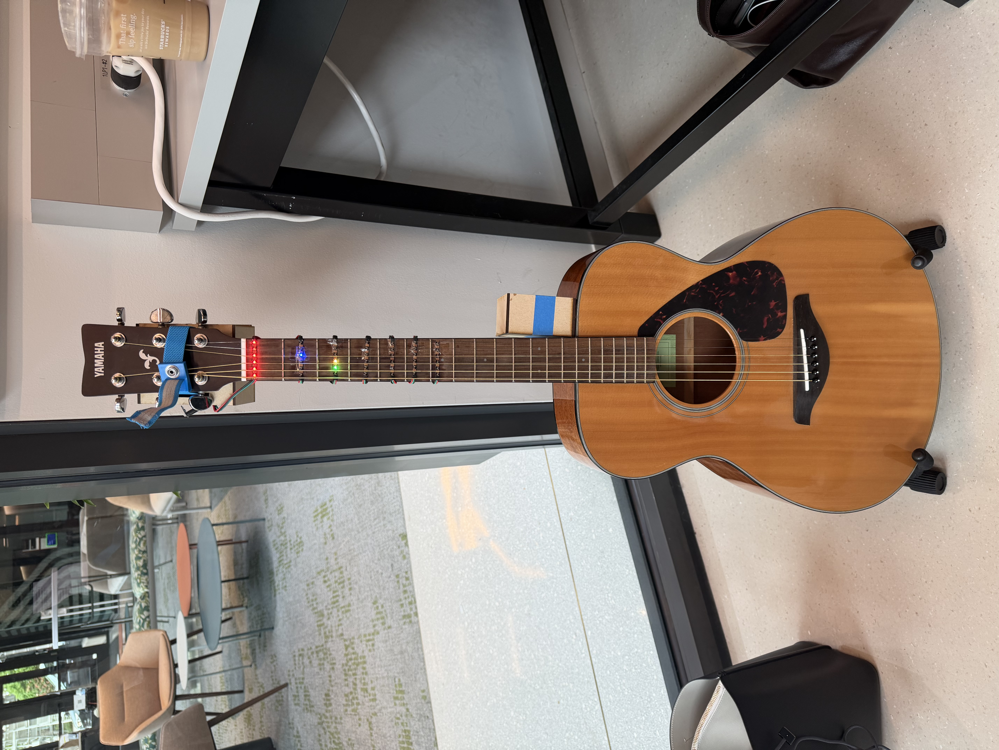
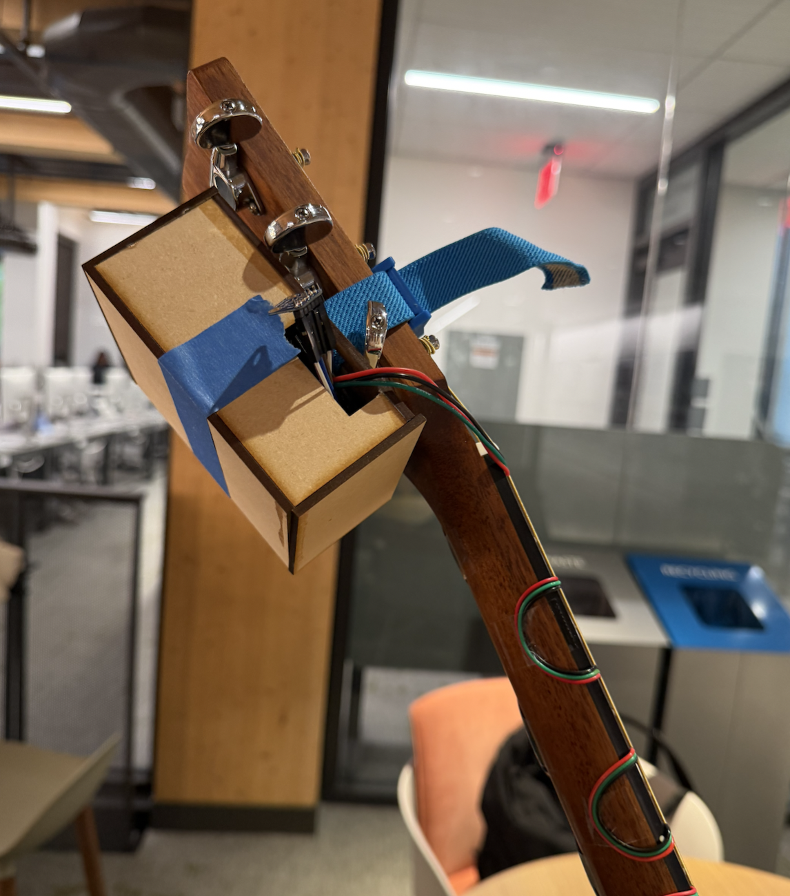
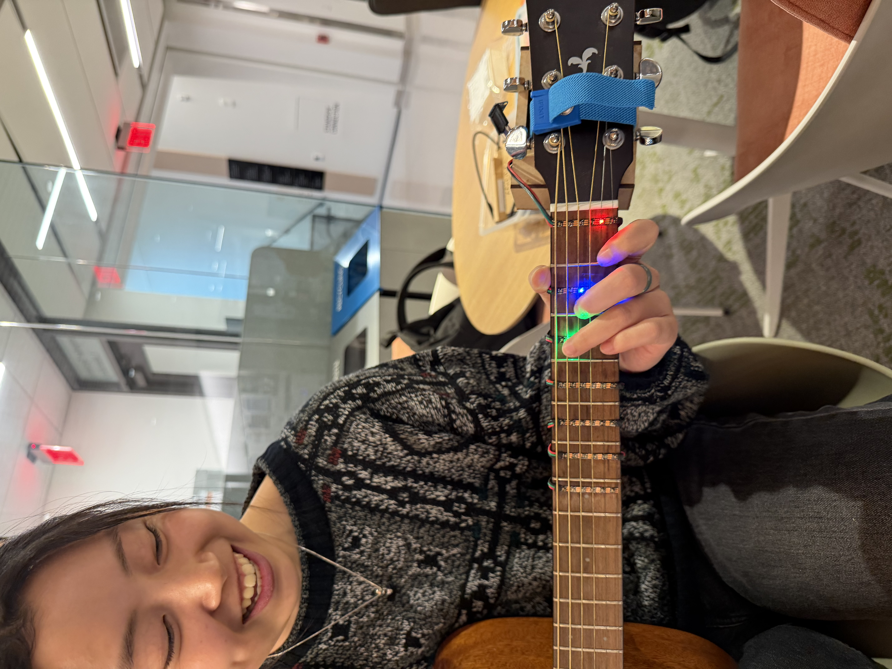
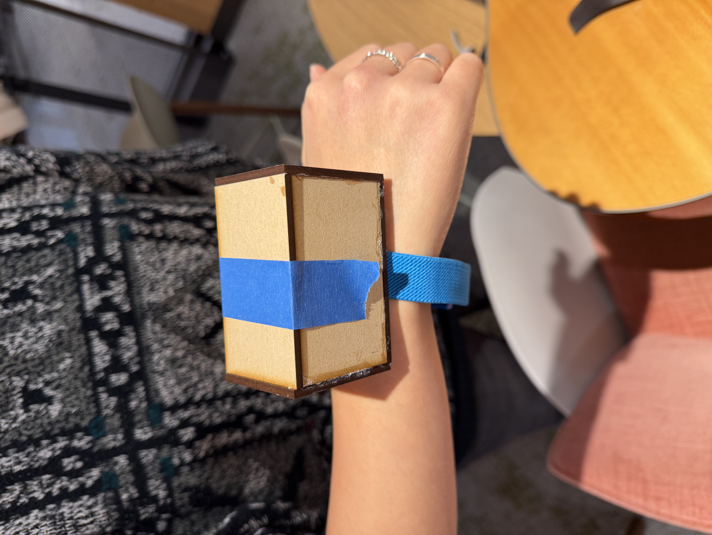

Standalone PCBA (Top):

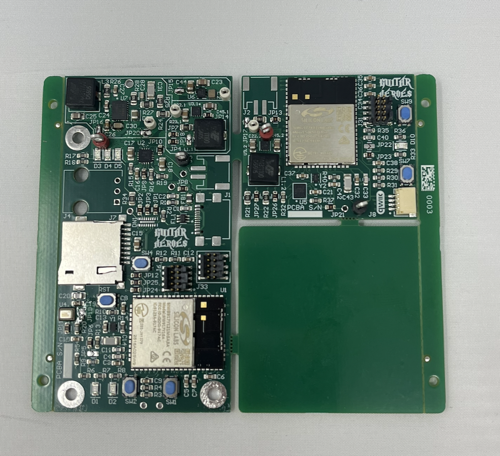

Standalone PCBA (Bottom):

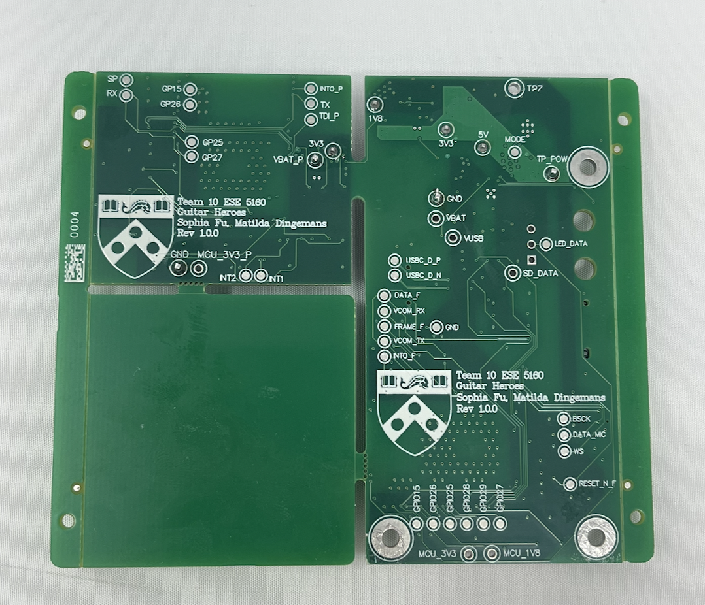

Thermal Camera Image (Power On):

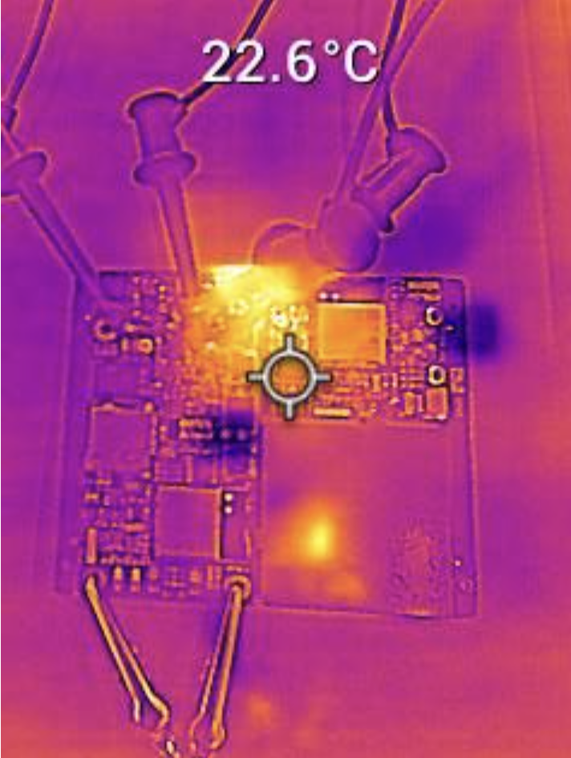

Altium Board (2D):

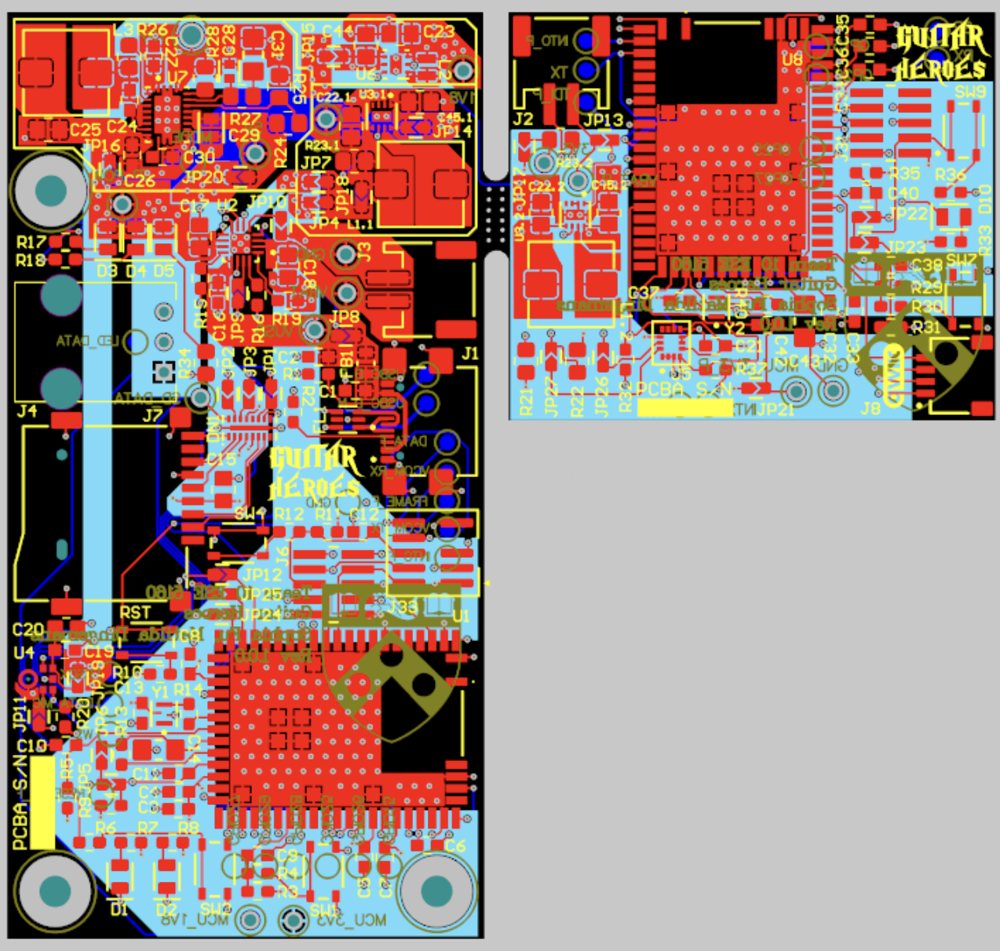

Altium Board (3D):

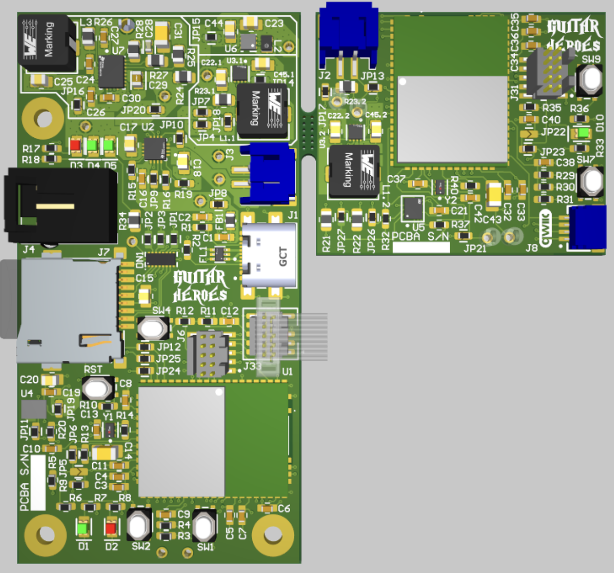

NodeRed Dashboard (Practice Mode):

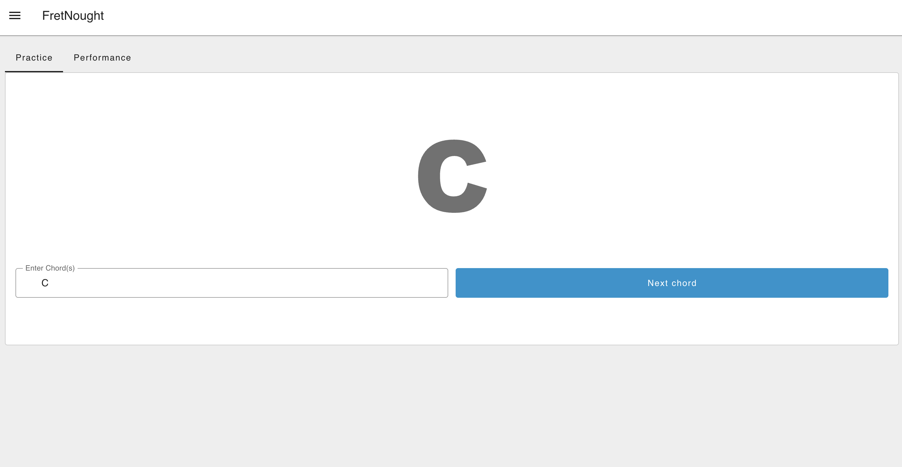

NodeRed Dashboard (Performance Mode):

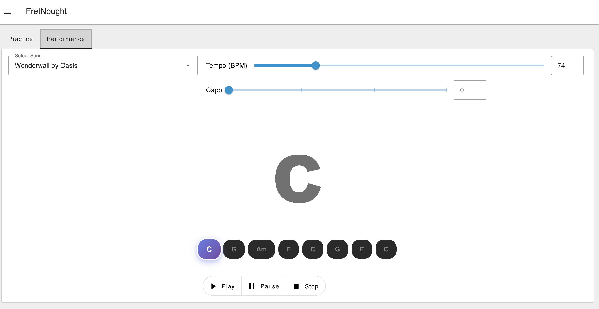

Node Red Dashboard (Dev):

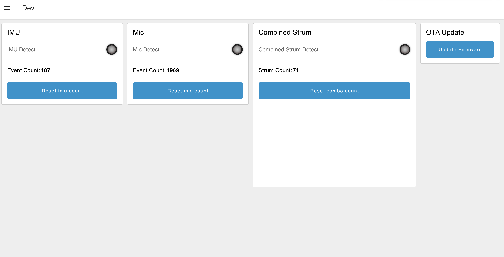

Node Red Backend:

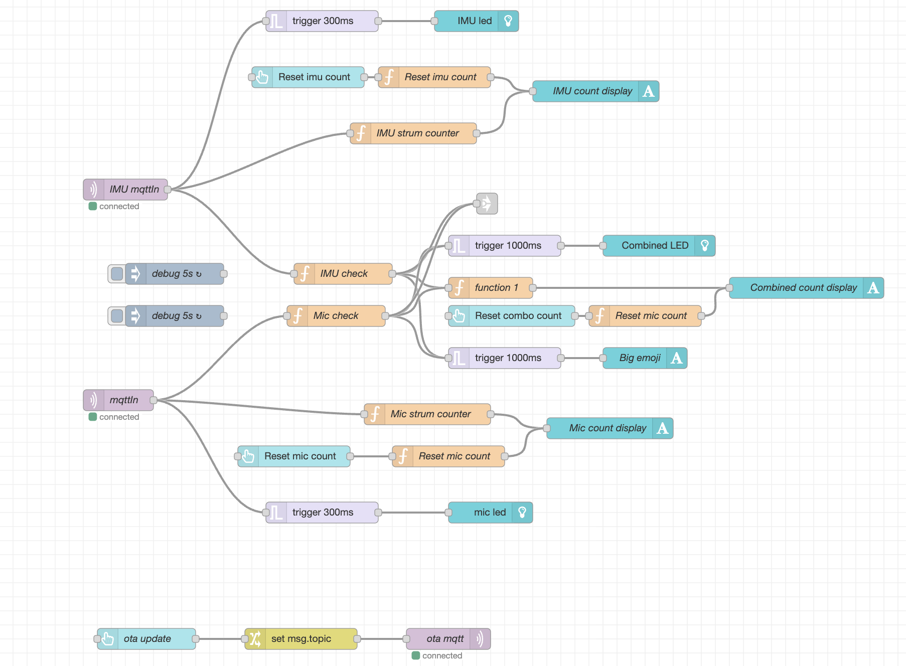
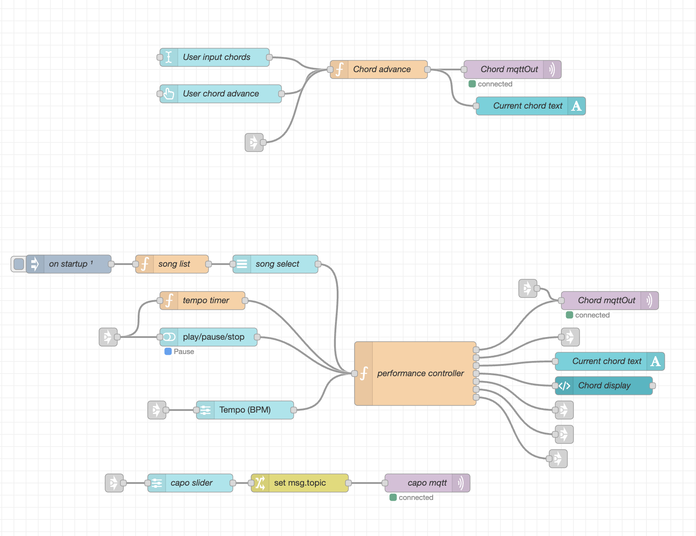

Block Diagram of System:

## 5. Codebase

Final Project Firmware: https://github.com/ese5160/final-project-firmware-s26-t10-guitar-heroes

- Fret device code in folder called fret_device (supports OTA updates)
- Pick device code in folder called pick_device

Node Red Dashboard: http://20.7.145.116:1880/dashboard
